# La⚡r Finance

**High-performance DeFi on Solana built for ultra-fast trading and execution.**

La⚡r Finance is a DeFi protocol whose goal is simple: **make trading and DeFi faster on Solana**. The project combines a proprietary market-making AMM (PropAMM) running inside a MagicBlock Ephemeral Rollup with mainnet perpetuals powered by [Flash Trade V2](https://docs.flash.trade), unified in a single trading terminal.

This document explains what La⚡r is, what has been built, how the on-chain programs work (with full pricing math), how the frontend ties everything together, and how to run and deploy the stack.

---

## Table of Contents

1. [Overview](#overview)
2. [What We Have Built](#what-we-have-built)
3. [Repository Structure](#repository-structure)
4. [System Architecture](#system-architecture)
5. [PropAMM — On-Chain Program](#propamm--on-chain-program)
6. [Pricing & Risk Engine (Mathematics)](#pricing--risk-engine-mathematics)
7. [Ephemeral Rollups, Cranks & Oracles](#ephemeral-rollups-cranks--oracles)
8. [Session Keys](#session-keys)
9. [Perps — Flash Trade V2 Integration](#perps--flash-trade-v2-integration)
10. [Copy Trade Autopilot](#copy-trade-autopilot)
11. [Frontend Application](#frontend-application)
12. [Technology Stack](#technology-stack)
13. [Networks & Program IDs](#networks--program-ids)
14. [Development Setup](#development-setup)
15. [Deployment (Vercel)](#deployment-vercel)
16. [Environment Variables](#environment-variables)
17. [Implementation Status](#implementation-status)
18. [Roadmap](#roadmap)

---

## Overview

Traditional Solana DeFi suffers from two bottlenecks:

1. **Latency** — base-layer block times and RPC round-trips add friction to active trading.
2. **Fragmentation** — spot, perps, and liquidity live in disconnected products.

La⚡r Finance addresses both by:

- Running a **proprietary AMM as an inventory-aware market maker** on a **MagicBlock Ephemeral Rollup (ER)**, with quotes refreshed every **50 ms** via native on-chain cranks and **Pyth Lazer** oracles.
- Integrating **Flash Trade V2 perpetuals** on mainnet, where trades execute on Flash’s Ephemeral Rollup (~30–50 ms fills) while account setup and fund movements settle on Solana mainnet.
- Providing a **unified terminal** (`lazr_fi_app`) for discovery, spot trading, perps, deposits, and devnet faucet access.

Beyond spot and perps, La⚡r is building a **suite of ultra-fast DeFi verticals** — prediction markets, lending, portfolio management, and more — all on the same Ephemeral Rollup + session key stack. See [Roadmap](#roadmap).

The design philosophy is **speed without sacrificing on-chain verifiability**: state transitions are program-enforced, oracles are read inside the rollup, and users retain self-custody via their own wallets and session keys.

---

## What We Have Built

### 1. PropAMM (`lazr_prop_amm`)

A **proprietary automated market maker** — not a traditional LP-token XYK pool. La⚡r acts as the house:

- Holds inventory in SPL vaults on Solana **devnet** (L1).
- Delegates mutable pool state to a **MagicBlock Ephemeral Rollup**.
- Updates bid/ask quotes every **50 ms** using **Pyth Lazer** prices, inventory skew, and realized volatility.
- Executes swaps against a **virtual constant-product curve** by debiting/crediting per-user **`UserBank`** ledgers on the ER — vault tokens move only on deposit/withdraw.

**Live devnet pairs:** BTC, ETH, SOL, PEPE, BONK (each vs USDC).

### 2. Perps via Flash Trade (`lazr_fi_app` + `flash-v2`)

Mainnet **perpetual futures** integrated via the Flash Trade V2 REST API and MagicBlock session keys:

- One-click enable (basket + ledger + delegate on mainnet).
- Popup-free trading on the Ephemeral Rollup after session approval.
- Live position/order streaming via Flash’s owner WebSocket.
- **Copy Trade Autopilot** UI (leader preview + selection; execution engine in progress).

**Supported perps markets:** SOL, BTC, ETH (vs USDC collateral).

### 3. Trading Terminal (`lazr_fi_app`)

Next.js 16 application:

| Route | Feature |
|-------|---------|
| `/` | Token discovery, live CoinGecko + PropAMM quotes |
| `/trade/[symbol]` | PropAMM spot terminal (swap, bank balances) |
| `/perps/[symbol]` | Flash V2 perps terminal |
| `/faucet` | Devnet test-token minting |

---

## Repository Structure

```
lazr_fi/
├── README.md                 ← this file
├── lazr_prop_amm/            ← Anchor on-chain program + devnet scripts
│   ├── programs/lazr_prop_amm/src/
│   │   ├── lib.rs            # #[ephemeral] program entry
│   │   ├── state/            # Pool, Config, QuoteState, UserBank, …
│   │   ├── math/             # Fixed-point pricing engine
│   │   ├── oracle/           # Pyth Lazer reader
│   │   └── instructions/     # Admin, crank, swap, deposit, delegation
│   ├── scripts/              # init-devnet-pools, run-pool-cranks
│   └── tests/                # Anchor + ER integration tests
│
└── lazr_fi_app/              ← Next.js trading terminal
    ├── app/                  # Routes, components, API routes
    ├── lib/
    │   ├── prop-amm/         # Anchor client, deposit/swap/withdraw, quotes
    │   ├── flash-trade/      # Flash V2 perps client, session keys, funds
    │   └── copy-trade/       # Copy-trade leader picker + preview
    └── app/data/
        └── devnet-tokens.json   # On-chain manifest (pools, mints, ER endpoints)
```


## System Architecture

La⚡r operates across **two independent product lines** that share UX patterns (session keys, ER trading, L1 settlement) but run on **different networks**:

| Product | Solana network | Rollup | Oracle / price source |
|---------|----------------|--------|------------------------|
| **PropAMM** | Devnet (L1) | MagicBlock devnet ER | Pyth Lazer (on-chain feed) |
| **Perps** | Mainnet (L1) | Flash / MagicBlock mainnet ER | Flash hosted API + on-chain marks |

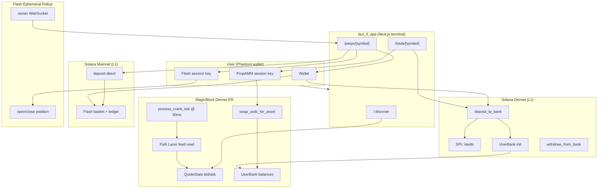

### End-to-end PropAMM user flow

1. **Deposit (L1)** — User sends SPL tokens to vault; `UserBank` is credited; bank may be delegated to ER.
2. **Quote updates (ER)** — Every 50 ms, crank reads Pyth Lazer, recomputes spread/bid/ask, writes `QuoteState`.
3. **Swap (ER)** — Session key signs swap; virtual curve computes output; `UserBank` debited/credited. No LP tokens minted.
4. **Withdraw (ER → L1)** — Two-step: undelegate on ER, settle SPL transfer on L1.

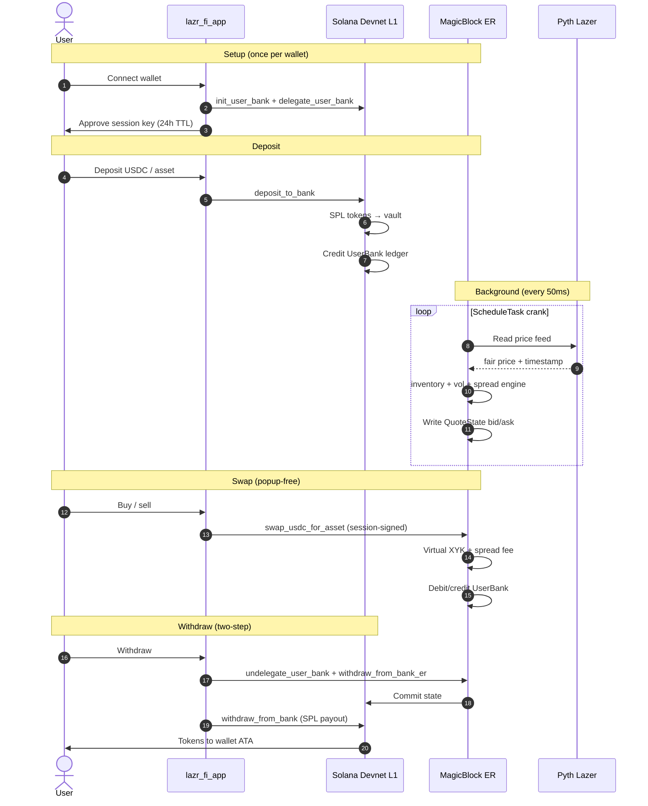

### End-to-end Perps user flow

1. **Enable (L1, once)** — Wallet signs: create Flash session → init basket → init deposit ledger → delegate basket.
2. **Deposit margin (L1)** — Explicit USDC deposit to Flash basket (separate consent step).
3. **Trade (ER)** — Session key signs open/close; tx submitted to Flash ER RPC (~30–50 ms).
4. **Stream** — `subscribeOwner()` WebSocket delivers live positions and orders.

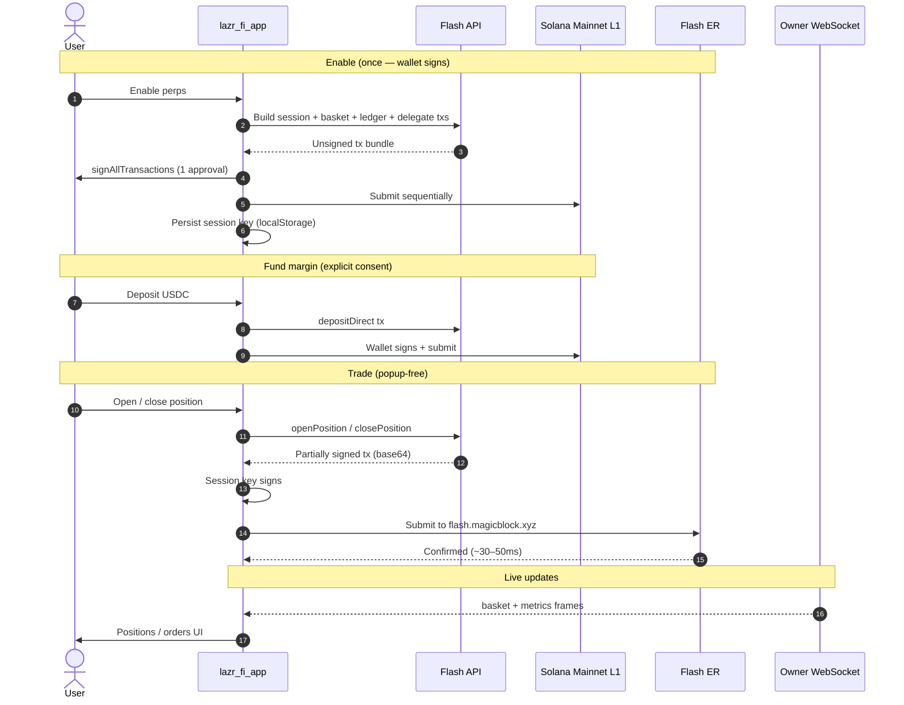

---

## PropAMM — On-Chain Program

### Program identity

| Field | Value |
|-------|-------|
| **Program ID (devnet)** | `CQMGqi6qSoJPCQzVMPi4Xdob9W4SS267JbSaK5yd3rTw` |
| **Framework** | Anchor + `#[ephemeral]` (MagicBlock Ephemeral Rollups SDK) |
| **Session keys crate** | `session-keys` (ER swap authorization) |

The program is declared with the MagicBlock ephemeral macro:

```rust
#[ephemeral]
#[program]
pub mod lazr_prop_amm { … }
```

This enables delegation of account state to an Ephemeral Rollup validator while keeping vaults and config on L1.

### Design: market maker, not LP pool

| Traditional AMM | La⚡r PropAMM |
|-------------------|--------------|
| LPs deposit, receive LP tokens | Admin seeds vaults; no LP tokens |
| Price from pool ratio | Price from **Pyth Lazer** + spread engine |
| Passive LPs earn fees | Protocol manages **inventory risk** |
| Swaps move vault balances | Swaps move **UserBank** ledger entries on ER |

There is **no leverage, margin, or borrowing** in the PropAMM program. All swaps are fully collateralized against the user’s `UserBank` balance.

### Account model (PDAs)

| Account | Seeds | Delegated to ER? | Purpose |
|---------|-------|------------------|---------|
| `AdminState` | `["admin"]` | No | Global admin + pool count |
| `Pool` | `["pool", asset_mint, usdc_mint]` | **Yes** | Pair metadata, vault refs, oracle IDs |
| `Config` | `["config", pool]` | No | Tunable parameters (spread, K, crank interval) |
| `QuoteState` | `["quote_state", pool]` | **Yes** | Live fair/bid/ask prices, spread |
| `RiskState` | `["risk_state", pool]` | **Yes** | Inventory ratio, vol, penalties |
| `VolatilityState` | `["volatility_state", pool]` | **Yes** | 32-slot price ring buffer |
| `HedgeState` | `["hedge_state", pool]` | **Yes** | Soft/hard hedge signal flags |
| `asset_vault` | `["asset_vault", pool]` | No | SPL token account (L1) |
| `usdc_vault` | `["usdc_vault", pool]` | No | USDC vault (L1) |
| `UserBank` | `["user_bank", user_authority]` | Per-user | Up to 20 `(mint, balance)` entries |

**Oracle feed PDA** (Pyth Lazer):

```
seeds = ["price_feed", "pyth-lazer", str(feed_id)]
program = PriCems5tHihc6UDXDjzjeawomAwBduWMGAi8ZUjppd
```

### Instructions

#### L1 (Solana base layer)

| Instruction | Description |
|-------------|-------------|
| `initialize_admin` | Create singleton admin PDA |
| `initialize_pool` | Bootstrap pool + 7 state accounts + 2 vaults |
| `update_config` | Update spread, depth, crank interval, etc. |
| `pause_pool` / `resume_pool` | Circuit breaker |
| `add_liquidity` / `remove_liquidity` | Admin vault seeding (**before** delegation) |
| `delegate_pool` | Delegate 5 accounts to ER validator |
| `init_user_bank` | Create per-user balance ledger |
| `delegate_user_bank` | Delegate user bank to ER |
| `deposit_to_bank` | SPL → vault + UserBank credit; optional redelegate |
| `withdraw_from_bank` | UserBank debit + SPL payout; optional redelegate |

#### ER (Ephemeral Rollup)

| Instruction | Description |
|-------------|-------------|
| `setup_crank` | Register `process_crank_tick` with Magic `ScheduleTask` |
| `process_crank_tick` | Read oracle → update quotes/risk/volatility |
| `swap_usdc_for_asset` | Buy asset (UserBank debit USDC, credit asset) |
| `swap_asset_for_usdc` | Sell asset |
| `undelegate_user_bank` | Commit + undelegate before L1 settlement |
| `withdraw_from_bank_er` | ER step 1 of two-step withdraw |

### Default pool parameters

| Parameter | Default | Meaning |
|-----------|---------|---------|
| `target_inventory_bps` | 5000 | Target 50% asset / 50% USDC by value |
| `base_spread_bps` | 5 | Minimum half-spread (0.05%) |
| `max_spread_bps` | 200 | Spread cap (2%) |
| `virtual_depth_k` | 1_000_000_000 | Virtual curve depth constant |
| `volatility_window_size` | 32 | Rolling window for realized vol |
| `crank_interval_ms` | **50** | Crank schedule interval |
| `max_trade_size` | 1e12 | Per-swap size limit (raw units) |
| `lambda` | 100 | Cubic inventory penalty coefficient |
| `max_oracle_staleness_sec` | 10 | Reject stale Pyth Lazer ticks |

### Fees

There is **no separate protocol fee parameter**. The only trading cost is the **spread deduction** applied to swap output (see [Swap output](#6-swap-output-virtual-xyk--spread-fee)).

---

## Pricing & Risk Engine (Mathematics)

All on-chain math uses **fixed-point integers** — no floating point. Key precision constants:

```
BPS_DENOMINATOR = 10_000        (basis points)
E8_PRECISION    = 100_000_000   (prices stored as e8)
```

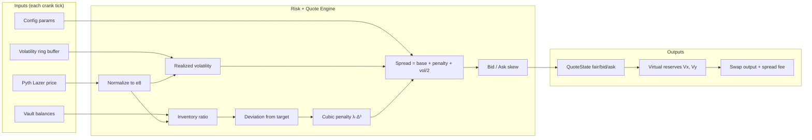

### 1. Oracle price normalization

Pyth Lazer prices arrive with a token-specific exponent. The crank normalizes to **e8** (8 decimal places):

```
fair_price_e8 = oracle_price × 10^(oracle_exponent + 8)
```

Implementation: `math/fixed_point.rs` → `i64_to_e8(val, exponent)`.

**Staleness guard:**

```
age = current_timestamp − oracle_timestamp
require age ≤ max_oracle_staleness_sec   (default 10s)
```

Swaps also reject stale quotes:

```
quote_age = now − quote_state.last_update_ts
require quote_age ≤ max_oracle_staleness_sec
```

### 2. Inventory ratio

At each crank tick, vault balances are read (L1 token accounts, readonly on ER) and valued at the fair price:

```
asset_value_e8 = Q_asset × fair_price_e8
usdc_value_e8  = Q_usdc  × 10^8
total_value_e8 = asset_value_e8 + usdc_value_e8

inventory_ratio_bps = (asset_value_e8 × 10_000) / total_value_e8
```

(`math/inventory.rs`)

### 3. Inventory deviation

```
deviation_bps = inventory_ratio_bps − target_inventory_bps
```

Example: if target is 5000 (50%) and current ratio is 7000 (70% asset-heavy), `deviation_bps = +2000`.

### 4. Cubic inventory penalty

The protocol discourages one-sided inventory buildup with a **cubic penalty**:

```
penalty_bps = λ × deviation_bps³ / 10_000²
```

Where `λ` (lambda) defaults to **100**.

**Intuition:** small deviations → tiny penalty; large deviations → rapidly widening spreads and skewed bid/ask, encouraging flow that rebalances inventory.

### 5. Realized volatility

A circular buffer stores the last **32** fair prices (`volatility_window_size`). Between consecutive prices:

```
ratio_bps      = (curr_price × 10_000) / prev_price
log_return_bps ≈ ratio_bps − 10_000        (log approximation)
```

Rolling variance and volatility:

```
variance               = Σ(log_return_bps²) / N
realized_volatility_bps  = isqrt(variance)
```

(`math/volatility.rs`)

### 6. Spread computation

```
spread_bps = base_spread_bps + |inventory_penalty_bps| + (realized_volatility_bps / 2)
spread_bps = min(spread_bps, max_spread_bps)
```

(`math/spread.rs`)

High volatility widens spreads; inventory imbalance widens spreads asymmetrically.

### 7. Bid / ask with inventory skew

```
half_spread      = spread_bps / 2
inventory_skew   = clamp(inventory_penalty_bps, −max_spread, +max_spread)

bid_adjustment   = half_spread + inventory_skew
ask_adjustment   = half_spread − inventory_skew

bid_e8 = fair_e8 − (fair_e8 × bid_adjustment / 10_000)
ask_e8 = fair_e8 + (fair_e8 × ask_adjustment / 10_000)
```

**Effect when asset-heavy (positive penalty):**

- Bid drops (less eager to buy more asset).
- Ask stays relatively attractive (eager to sell asset).

**Effect when USDC-heavy (negative penalty):** the reverse — bid rises, ask rises.

### 8. Virtual reserves (constant-product curve)

The AMM does not use literal vault balances for swap math. Instead it constructs **virtual reserves** from fair price and depth constant `K`:

```
sqrt_P = isqrt(price_e8 × 10^8)

Vy = K × sqrt_P / 10^8          (virtual USDC reserve)
Vx = K × 10^8 / sqrt_P          (virtual asset reserve)
```

Decimal normalization when `usdc_decimals ≠ asset_decimals`:

```
if usdc_decimals > asset_decimals:
    Vy ×= 10^(usdc_decimals − asset_decimals)
else:
    Vx ×= 10^(asset_decimals − usdc_decimals)
```

(`math/swap.rs`, `math/sqrt.rs`)

### 9. Swap output (virtual XYK + spread fee)

**Sell asset → receive USDC** (`compute_swap_asset_for_usdc`):

```
new_Vx       = Vx + amount_in
new_Vy       = (Vx × Vy) / new_Vx
gross_output = Vy − new_Vy
spread_fee   = gross_output × spread_bps / 10_000
net_output   = gross_output − spread_fee
```

**Buy asset with USDC** (`compute_swap_usdc_for_asset`): symmetric with `Vy + amount_in`.

The user specifies `min_amount_out` for slippage protection; the program rejects if `net_output < min_amount_out`.

### 10. Hedge signals (informational)

```
hedge_required = (|inventory_ratio_bps| ≥ HEDGE_HARD_LIMIT_BPS)   // default 8500 (85%)
```

Soft limit at **7000 bps (70%)**. These flags are **signals only** — no on-chain hedge execution is implemented.

---

## Ephemeral Rollups, Cranks & Oracles

### MagicBlock Ephemeral Rollups

An Ephemeral Rollup (ER) is a high-throughput execution environment paired with Solana L1:

- **L1** holds canonical account data, vaults, and config.
- **Delegation** copies mutable state to an ER validator for fast reads/writes.
- **Commit + undelegate** flushes ER state back to L1 for settlement.

La⚡r uses ER for:

- **PropAMM:** quote updates + swaps (`devnet-eu.magicblock.app`)
- **Flash Perps:** open/close positions (`flash.magicblock.xyz` on mainnet)

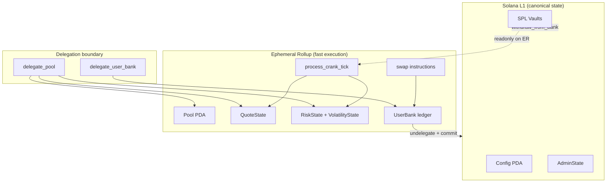

### 50 ms crank schedule

Quote freshness is maintained by MagicBlock’s native **`ScheduleTask`** CPI:

```rust
MagicBlockInstruction::ScheduleTask(ScheduleTaskArgs {
    task_id: pyth_lazer_feed_id,
    execution_interval_millis: 50,    // DEFAULT_CRANK_INTERVAL_MS
    iterations: 0,                    // 0 = infinite until cancelled
    instructions: vec![process_crank_tick_ix],
})
```

Each crank tick executes the full pipeline:

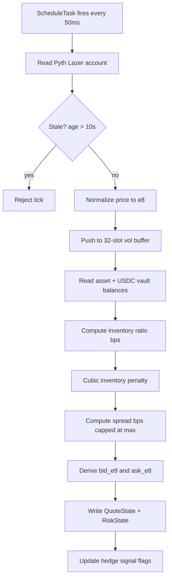

**Off-chain fallback:** `scripts/run-pool-cranks.ts` can fire ticks manually if on-chain scheduling is unavailable.

### Pyth Lazer oracles

PropAMM reads **Pyth Lazer** price feeds deployed on devnet. Raw account layout (byte offsets):

| Field | Offset | Type |
|-------|--------|------|
| Price | 73 | i64 LE |
| Confidence | 81 | u64 LE |
| Timestamp | 93 | i64 LE |

Program: `PriCems5tHihc6UDXDjzjeawomAwBduWMGAi8ZUjppd`

Pyth Lazer supports sub-100 ms update rates on major feeds (BTC, ETH, SOL at 50 ms). The crank interval matches this cadence.

| Symbol | Pyth Lazer ID | Exponent | Decimals |
|--------|---------------|----------|----------|
| BTC | 1 | −8 | 8 |
| ETH | 2 | −8 | 8 |
| SOL | 6 | −8 | 9 |
| PEPE | 4 | −10 | 6 |
| BONK | 9 | −10 | 5 |

---

## Session Keys

Both PropAMM and Flash Perps use **MagicBlock session keys** so users approve once, then trade at ER speed without repeated wallet popups.

### How session keys work

1. User connects wallet (L1).
2. App generates an ephemeral **session keypair** (24h TTL).
3. User signs a **one-time** L1 transaction bundle that:
   - Creates a session token PDA (`session_token_v2` seed).
   - Funds the session signer with rent (~0.01 SOL).
   - Delegates relevant accounts to the ER.
4. Subsequent ER instructions include `signer` + `sessionToken` fields; the session keypair signs instead of the wallet.

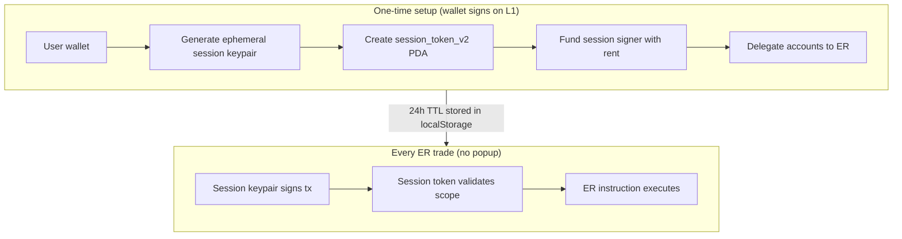

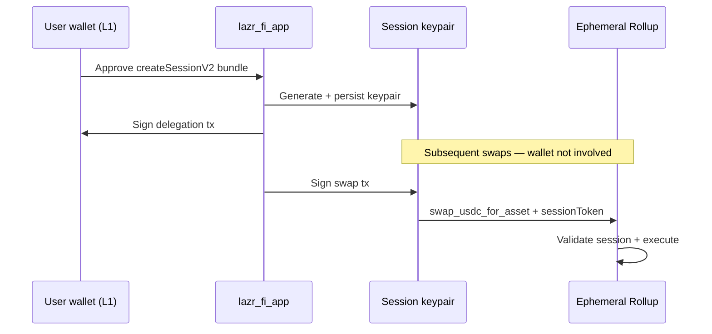

### PropAMM sessions (`lib/prop-amm/session.ts`)

- Storage: `localStorage` → `lazr_session_signer_{pubkey}`
- Created via `SessionTokenManager.createSessionV2` on **devnet L1**
- Signs: ER swaps, ER undelegate, ER withdraw step 1

### Flash Perps sessions (`lib/flash-trade/session.ts`)

- Storage: `localStorage` → `lazr-flash-session`
- Programs:
  - Magic Trade: `FTv2RxXarPfNta45HTTMVaGvjzsGg27FXJ3hEKWBhrzV`
  - Session Keys: `KeyspM2ssCJbqUhQ4k7sveSiY4WjnYsrXkC8oDbwde5`
- Enable flow signs on **mainnet L1**; trades sign on **Flash ER**

**Security model:** session keys are scoped, time-limited, and revocable. They can only execute program instructions the user pre-authorized — not withdraw L1 funds without the explicit withdraw flow.

---

## Perps — Flash Trade V2 Integration

La⚡r does not operate its own perps program. Perpetuals are provided by **Flash Trade V2** on Solana mainnet, integrated via the open-source [`flash-v2`](../../flash-trade-examples-v2/packages/flash-v2) TypeScript SDK.

### Two-chain model (Flash)

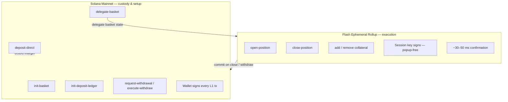

### Flash API surface used

| Category | Methods |
|----------|---------|
| **Reads** | `owner()`, `price()`, `tokens()`, `poolData()` |
| **Setup (L1)** | `initBasket`, `initDepositLedger`, `delegateBasket` |
| **Trading (ER)** | `openPosition`, `closePosition` |
| **Funds (L1)** | `depositDirect`, `requestWithdrawal`, `executeWithdrawal` |
| **Streaming** | `subscribeOwner()` WebSocket (basket + metrics frames) |

### Enable flow (one wallet approval)

Implemented in `lib/flash-trade/enable.ts`:

1. Precheck wallet SOL for rent + session top-up.
2. Build unsigned txs: create session → init basket → init ledger → delegate.
3. User signs all via `signAllTransactions` (single approval).
4. Submit sequentially on mainnet base RPC.

**Explicit consent rule:** USDC is never moved during enable. Deposits are a separate user action (`lib/flash-trade/funds.ts`).

### Trading flow

1. `flash.openPosition({ owner, signer, sessionToken, … })` → partially signed tx (base64).
2. `sessionKeypair.sign` + submit to **ER RPC**.
3. `subscribeOwner(owner)` streams updated positions.

TP/SL on open is wired in the UI (`takeProfit` / `stopLoss` params). Standalone TP/SL management (add/edit/cancel on existing positions) is not yet implemented.

### Mainnet RPC proxy

Browsers cannot call public mainnet RPC directly (403). The app proxies via:

```
POST /api/mainnet-rpc  →  MAINNET_RPC_URL (server env)
```

Configured in `lib/flash-trade/client.ts`.

---

## Copy Trade Autopilot

The perps **Autopilot** tab provides a **copy trading preview**:

| Component | Status |
|-----------|--------|
| Curated leader list (`COPY_LEADERS_JSON` or defaults) | ✅ |
| Custom leader address input | ✅ |
| Live leader position preview (`subscribeOwner`) | ✅ |
| Leader stats (notional, unrealized PnL) | ✅ |
| **Start copying (mirror engine)** | 🔜 Not yet implemented |

**How copy trading will work** (reference: `flash-trade-examples-v2/examples/copy-trade/`):

1. Stream leader’s basket via `subscribeOwner(LEADER)`.
2. Diff consecutive **`basket`** frames into `OPEN / GROW / SHRINK / CLOSE` events.
3. Size mirrors proportionally: `mirror = leader_Δ × (follower_margin / leader_margin)`.
4. Execute via `flash.openPosition` / `closePosition` with follower session key.

There is **no Flash API leaderboard** — leaders are app-configured public keys.

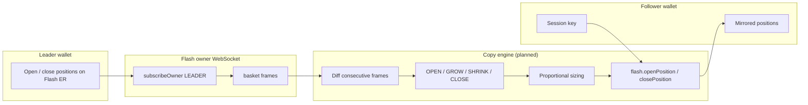

---

## Frontend Application

### Routes

| Path | Page | Key components |
|------|------|----------------|
| `/` | Discover | `TokenTable`, `HeroBar`, `AllPoolQuotesProvider` |
| `/trade/[symbol]` | PropAMM terminal | `SwapPanel`, `TradingChart`, `PoolQuoteProvider` |
| `/perps/[symbol]` | Perps terminal | `PerpsTradePanel`, `PerpsPositionsPanel`, `FlashTradeProvider` |
| `/faucet` | Devnet faucet | `FaucetPanel` |

### API routes

| Endpoint | Purpose |
|----------|---------|
| `GET /api/market` | CoinGecko prices (60s cache) |
| `POST /api/faucet` | Mint devnet tokens |
| `POST /api/mainnet-rpc` | Mainnet JSON-RPC proxy |
| `GET /api/copy-leaders` | Curated copy-trade leaders |

### Provider architecture

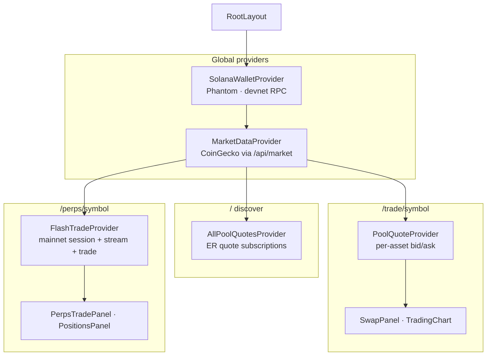

### PropAMM client modules (`lib/prop-amm/`)

| Module | Role |
|--------|------|
| `program.ts` | Anchor `Program` — L1 devnet + ER connections |
| `deposit.ts` | L1 deposit + optional ER redelegation |
| `withdraw.ts` | Two-step ER undelegate → L1 settle |
| `swap.ts` | ER swaps (session-signed) |
| `session.ts` | PropAMM session key lifecycle |
| `delegation.ts` | Magic Router delegation status |
| `quote-math.ts` / `quote-decode.ts` | Client-side quote decoding |
| `er-connection.ts` | ER WebSocket + account subscriptions |

### Dual-network wallet note

The wallet adapter connects to **devnet** (PropAMM + faucet). Flash perps independently use **mainnet** RPC/API via `lib/flash-trade/client.ts`. The same Phantom wallet pubkey works on both; users must hold devnet SOL for PropAMM and mainnet USDC for perps.

---

## Technology Stack

### On-chain (PropAMM)

| Technology | Version | Role |
|------------|---------|------|
| **Rust + Anchor** | 0.30.x | Program framework |
| **ephemeral-rollups-sdk** | 0.14.3 | `#[ephemeral]`, delegation macros |
| **magicblock-magic-program-api** | 0.10.1 | `ScheduleTask` crank CPI |
| **session-keys** | 3.1.1 | ER instruction authorization |
| **Pyth Lazer** | On-chain feeds | Sub-100 ms oracle prices |

### Frontend (`lazr_fi_app`)

| Technology | Role |
|------------|------|
| **Next.js 16** | App Router, SSG, API routes |
| **React 19** | UI |
| **TypeScript 5** | Strict typing |
| **Tailwind CSS v4** | Terminal dark/gold theme |
| **@solana/web3.js** | Transactions, connections |
| **@solana/wallet-adapter** | Phantom wallet |
| **@coral-xyz/anchor** | PropAMM client |
| **@magicblock-labs/gum-sdk** | Session token manager |
| **@magicblock-labs/ephemeral-rollups-sdk** | Magic program IDs |
| **flash-v2** (local package) | Flash Trade V2 REST + WebSocket client |

### External services

| Service | Usage |
|---------|-------|
| **CoinGecko** | Discover page market data |
| **TradingView** | Embedded charts |
| **MagicBlock devnet ER** | PropAMM execution |
| **Flash API** (`flashapi.trade/v2`) | Perps quotes + tx building |
| **Flash ER** (`flash.magicblock.xyz`) | Perps trade submission |

---

## Networks & Program IDs

### PropAMM (devnet)

| Item | Address / URL |
|------|---------------|
| Program ID | `CQMGqi6qSoJPCQzVMPi4Xdob9W4SS267JbSaK5yd3rTw` |
| USDC mint | `CPFGHVHzfDDWRLZFGXibfhAUMyxcojiYvoS4HNqWpNR9` |
| ER HTTP | `https://devnet-eu.magicblock.app/` |
| ER WebSocket | `wss://devnet-eu.magicblock.app/` |
| ER validator | `MEUGGrYPxKk17hCr7wpT6s8dtNokZj5U2L57vjYMS8e` |
| Magic Router | `https://devnet-router.magicblock.app` |
| Pyth Lazer program | `PriCems5tHihc6UDXDjzjeawomAwBduWMGAi8ZUjppd` |

Full pool PDAs, mints, and oracle feeds: `lazr_fi_app/app/data/devnet-tokens.json`

### Flash Perps (mainnet)

| Item | Address / URL |
|------|---------------|
| Magic Trade program | `FTv2RxXarPfNta45HTTMVaGvjzsGg27FXJ3hEKWBhrzV` |
| Session Keys program | `KeyspM2ssCJbqUhQ4k7sveSiY4WjnYsrXkC8oDbwde5` |
| Flash API | `https://flashapi.trade/v2` |
| Flash ER RPC | `https://flash.magicblock.xyz` |

---

## Development Setup

### Prerequisites

- Rust + Solana CLI + Anchor
- Node.js 20+
- Bun or npm
- Devnet SOL (for PropAMM deploy + testing)
- Pyth Lazer oracle feeds initialized on devnet (bootstrap script checks this)

### PropAMM program

```bash
cd lazr_fi/lazr_prop_amm

# Build + test
anchor build
anchor test

# Bootstrap all devnet pools (BTC, ETH, SOL, PEPE, BONK)
anchor run init-devnet-pools

# Schedule infinite on-chain cranks (50ms)
anchor run run-pool-cranks-setup

# Or run off-chain keeper loop
anchor run run-pool-cranks
```

The bootstrap script writes `app/data/devnet-tokens.json` in the frontend automatically.

### Frontend app

```bash
cd lazr_fi/lazr_fi_app

cp .env.example .env.local
# Fill in RPC URLs and FAUCET_AUTHORITY_SECRET_KEY

npm install    # postinstall links flash-v2 from monorepo
npm run dev    # http://localhost:3000
```

### Monorepo dependency note

`lazr_fi_app` depends on Flash V2 via:

```json
"flash-v2": "file:../../flash-trade-examples-v2/packages/flash-v2"
```

The **`flash-trade-examples-v2`** folder must exist at the monorepo root. A `postinstall` script installs flash-v2’s own dependencies for Vercel builds.

---

## Deployment (Vercel)

| Setting | Value |
|---------|-------|
| **Repository** | Full monorepo (must include `flash-trade-examples-v2/`) |
| **Root Directory** | `lazr_fi/lazr_fi_app` |
| **Framework** | Next.js |
| **Build command** | `npm run build` (default) |

The PropAMM program is deployed to **Solana devnet** separately via Anchor — it does not run on Vercel. Vercel hosts only the Next.js frontend and API routes.

---

## Environment Variables

### Required for full functionality

| Variable | Scope | Purpose |
|----------|-------|---------|
| `NEXT_PUBLIC_SOLANA_RPC_URL` | Public | Devnet RPC (wallet + PropAMM) |
| `FAUCET_AUTHORITY_SECRET_KEY` | **Server only** | JSON byte array of mint authority keypair |
| `MAINNET_RPC_URL` | **Server only** | Upstream for `/api/mainnet-rpc` (perps) |

### Optional

| Variable | Purpose |
|----------|---------|
| `NEXT_PUBLIC_FLASH_API_BASE` | Override Flash API URL |
| `NEXT_PUBLIC_ER_RPC` | Override Flash ER RPC |
| `COPY_LEADERS_JSON` | Curated copy-trade leaders (server) |

**Never** prefix private keys or mainnet RPC API keys with `NEXT_PUBLIC_`.

See `lazr_fi_app/.env.example` for the full list.

---

## Implementation Status

| Feature | Status |
|---------|--------|
| PropAMM on-chain program | ✅ Devnet |
| 50 ms cranks + Pyth Lazer quotes | ✅ |
| PropAMM deposit / swap / withdraw | ✅ |
| Session keys (PropAMM + Flash) | ✅ |
| Flash perps enable / trade / deposit / withdraw | ✅ Mainnet |
| Live position streaming | ✅ |
| TP/SL on open | ✅ |
| TP/SL management on existing positions | 🔜 |
| Copy trade autopilot execution | 🔜 Preview UI only |
| Swap autopilot strategies | 🔜 UI mock |
| Limit orders (PropAMM) | 🔜 UI state only |
| Predict / Lend / Portfolio nav | 🔜 Placeholders |
| On-chain hedge execution | 🔜 Signal flags only |

See [Roadmap](#roadmap) for the full product vision beyond the current terminal.

---

## Roadmap

La⚡r Finance is not a single product — it is a **platform for ultra-fast DeFi on Solana**. PropAMM and Flash Perps are the first two verticals shipped in the terminal. The long-term vision is a unified suite of latency-optimized protocols that share the same execution stack: **Ephemeral Rollups**, **session keys**, **sub-100 ms oracles**, and **Solana L1 settlement**.

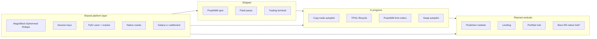

### Vision

Every La⚡r product follows the same design pattern:

| Layer | Role |
|-------|------|
| **L1 (Solana)** | Custody, deposits, withdrawals, config, final settlement |
| **Ephemeral Rollup** | High-frequency state updates, order matching, quote refresh, trade execution |
| **Oracles** | Pyth Lazer and protocol-specific feeds for fair pricing |
| **Cranks** | On-chain schedulers (e.g. 50 ms) to keep state fresh without off-chain keepers |
| **Session keys** | One wallet approval → popup-free trading for hours |
| **Terminal** | Single UX surface: discover, trade, manage positions, autopilot |

The goal across all verticals remains unchanged: **make DeFi on Solana feel instant**.

---

### Phase 1 — Foundation ✅ (current)

| Milestone | Status |
|-----------|--------|
| PropAMM on-chain program (devnet) | ✅ |
| 50 ms cranks + Pyth Lazer integration | ✅ |
| PropAMM deposit / swap / withdraw | ✅ |
| Flash Trade V2 perps (mainnet) | ✅ |
| Unified trading terminal (`lazr_fi_app`) | ✅ |
| Session keys (PropAMM + Flash) | ✅ |
| Live position streaming | ✅ |
| Devnet faucet + token discovery | ✅ |

---

### Phase 2 — Terminal completion 🔜 (near-term)

Polish and complete the products already in the terminal before expanding to new verticals.

| Milestone | Description | Status |
|-----------|-------------|--------|
| **Copy trade autopilot** | Mirror leader positions proportionally via Flash ER session keys | 🔜 Engine in progress (preview UI live) |
| **TP/SL lifecycle** | Add, edit, cancel take-profit / stop-loss on open positions | 🔜 Open-only wired today |
| **PropAMM limit orders** | Resting orders filled against crank-updated quotes | 🔜 UI scaffold only |
| **Swap autopilot** | Automated spot strategies on PropAMM (DCA, grid, etc.) | 🔜 UI mock |
| **On-chain hedging** | Execute hedge trades when inventory signals fire | 🔜 Signal flags only |
| **PropAMM mainnet** | Audit, deploy program + pools to mainnet | 🔜 Devnet today |
| **Expanded spot pairs** | Bootstrap remaining Pyth Lazer feeds (20 supported in program) | 🔜 5 live on devnet |

---

### Phase 3 — Prediction markets 📋 (planned)

Ultra-fast **event markets** where odds update in real time and users trade outcomes without wallet friction.

| Planned capability | Approach |
|--------------------|----------|
| Real-time odds | ER-native order book or AMM with crank-driven mark updates |
| Oracle resolution | Pyth Lazer + custom resolution feeds for event settlement |
| Instant fills | Session-key-signed trades on Ephemeral Rollup |
| L1 settlement | Deposits, withdrawals, and final payout on Solana base layer |

**Terminal nav:** `Predict` (placeholder in header today)

Use cases: crypto-native events (ETF approvals, rate decisions, token launches), sports, and macro — anywhere **speed of price discovery** matters.

---

### Phase 4 — Lending 📋 (planned)

**High-performance lending** with borrow/lend rates refreshed at ER speed and liquidations triggered by sub-second oracle ticks.

| Planned capability | Approach |
|--------------------|----------|
| Dynamic rates | Crank-updated utilization curves (similar cadence to PropAMM quotes) |
| Fast liquidations | ER execution when health factor breaches threshold |
| Cross-product collateral | PropAMM `UserBank` balances and perps margin as composable collateral (TBD) |
| Isolated + pooled markets | Configurable risk parameters per asset |

**Terminal nav:** `Lend` (placeholder in header today)

Lending shares PropAMM’s inventory and oracle infrastructure — vault accounting on L1, rate/health logic on ER.

---

### Phase 5 — Portfolio & cross-product hub 📋 (planned)

A unified **Portfolio** view aggregating every La⚡r vertical in one place.

| Planned capability | Description |
|--------------------|-------------|
| **Unified balances** | PropAMM bank, perps margin, lend deposits, prediction market positions |
| **Cross-margin view** | Net exposure and PnL across spot, perps, and lend |
| **One-click funding** | Route USDC between products without leaving the terminal |
| **Autopilot dashboard** | Manage copy-trade, swap, and future strategy bots from one panel |

**Terminal nav:** `Portfolio` (partially wired via deposit dropdown for perps today)

---

### Phase 6 — Platform expansion 📋 (future)

Additional ultra-fast DeFi primitives built on the same La⚡r stack:

| Vertical | Why ER-native |
|----------|---------------|
| **Options / structured products** | Continuous greek refresh + instant hedge execution |
| **Intent-based routing** | Solver fills against PropAMM + external liquidity at ER speed |
| **Vaults / yield strategies** | Automated rebalancing cranks without MEV-sensitive L1 txs |
| **RWA / tokenized assets** | Oracle-driven pricing with L1 redemption rails |

Each new product reuses session keys, cranks, and the terminal shell — users get one wallet, one session model, one interface.

---

### Shared infrastructure roadmap

Improvements that benefit **all** La⚡r products:

| Initiative | Benefit |
|------------|---------|
| Mainnet PropAMM deployment | Production spot liquidity |
| Multi-rollup routing | Optimal ER validator per region |
| Unified session layer | One session key across PropAMM, perps, predict, lend |
| Mobile-first terminal | Bottom nav already stubs Predict / Lend |
| Public API + SDK | Third-party integrators build on La⚡r liquidity |
| Analytics & indexing | Pool stats, volume, leader PnL, lend utilization |

---

### How to follow progress

- **Shipped features** → [Implementation Status](#implementation-status)
- **Terminal placeholders** → Header nav (`Predict`, `Lend`, `Portfolio`) and mobile bottom nav
- **On-chain programs** → New Anchor crates under `lazr_fi/` as verticals launch (e.g. `lazr_predict`, `lazr_lend`)

La⚡r Finance starts with **fast spot and fast perps**. The roadmap extends that same execution philosophy to **prediction markets, lending, portfolio management, and beyond** — one platform, built for speed on Solana.

---

## How It All Ties Together

La⚡r Finance is a **speed-layered DeFi stack**:

1. **Pyth Lazer** delivers institutional-grade prices at 50–200 ms.
2. **MagicBlock Ephemeral Rollups** execute state transitions in ~10 ms blocks — cranks update quotes, swaps settle against virtual curves, and perps fill without wallet friction.
3. **50 ms ScheduleTask cranks** keep PropAMM quotes synchronized with oracle ticks and inventory state.
4. **Session keys** eliminate repeated wallet approvals for ER-speed trading on both products.
5. **Solana L1** remains the settlement and custody layer — vaults, deposits, withdrawals, and Flash basket lifecycle all finalize on base chain.
6. **The terminal** unifies discovery, spot, perps, and (soon) copy trading in one interface.

The result: a protocol built from the ground up for **latency-sensitive trading on Solana**, with on-chain-enforced pricing math, non-custodial session authorization, and a clear separation between fast execution (ER) and secure settlement (L1).

---

## Further Reading

- [MagicBlock Ephemeral Rollups](https://docs.magicblock.gg)
- [Flash Trade V2 Documentation](https://docs.flash.trade)
- [Pyth Lazer](https://docs.pyth.network/lazer)
- PropAMM program details: `lazr_prop_amm/README.md`
- Flash V2 gotchas: `flash-trade-examples-v2/GOTCHAS.md`
