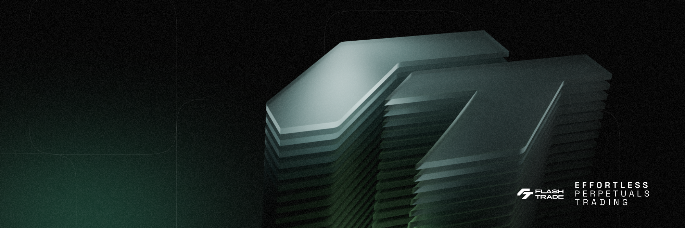
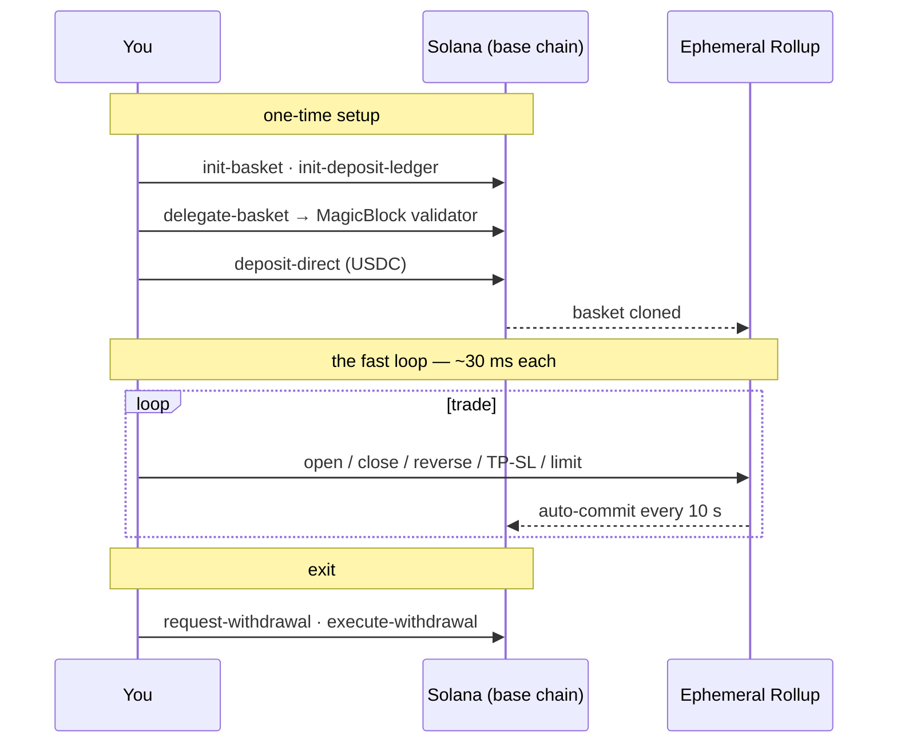
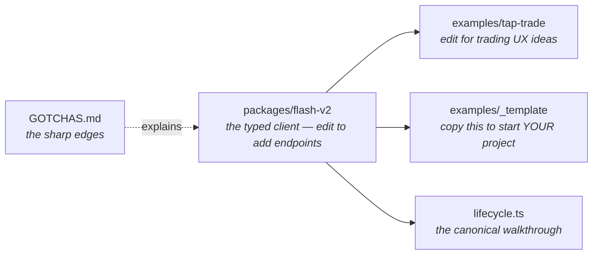

<div align="center">



# ⚡ Perps at ~50 ms.

### The official starter for building on Flash Trade's MagicBlock layer

Clone to your first ephemeral-rollup trade in minutes. Mainnet — real funds.

[](https://github.com/flash-trade/examples-v2/actions/workflows/ci.yml)
[](./LICENSE)
[](https://flashapi.trade/v2/health)
[](#networks)
[](https://flash.trade)
[](https://docs.magicblock.gg)

**[Quickstart](#the-60-second-proof) • [Examples](#learning-path) • [Gotchas](./GOTCHAS.md) • [API Docs](https://flashapi.trade/docs) • [Workshop](https://luma.com/x57f72d7)**

</div>

---

## What is this?

**Flash Trade V2** runs perpetual futures on a [MagicBlock Ephemeral Rollup](https://docs.magicblock.gg) — your account is *delegated* to a rollup validator, trades confirm in **~30–50 ms** for near-zero cost, and state commits back to Solana every 10 s. The entire public surface is a **hosted REST API** (no SDK needed — this repo includes the typed client). You're early: **this starter is the first public client of V2.**

## The 60-second proof

No clone, no auth — the API is live right now:

```bash
curl https://flashapi.trade/v2/prices/SOL
```

Then make it yours:

> Prerequisite: [bun](https://bun.sh) (`curl -fsSL https://bun.sh/install | bash`).

```bash
git clone https://github.com/flash-trade/examples-v2
cd examples-v2
bun install
bun run hello        # live SOL price + a real trade quote — no wallet needed
bun run lifecycle    # the full account walkthrough (dry-run, signs nothing)
```

## See it

**`examples/tap-trade`** — one tap → market long/short → **confirmed on the Ephemeral Rollup with a live latency HUD** (~30–50 ms vs ~400 ms on L1), zero wallet popups. Three minutes to run: [examples/tap-trade](./examples/tap-trade).

## The mental model

One account lifecycle, two chains. Setup and withdrawal happen on **Solana (base chain)**; trading happens on the **Ephemeral Rollup**:



Two rules that prevent 90% of confusion: **trading txs submit to the ER RPC, setup/withdrawal to the base RPC** — and every transaction comes back **partially signed** (you add only your signature; never touch the blockhash). The client handles both: [`packages/flash-v2`](./packages/flash-v2).

## Learning path

| # | Start here | What you build | The hard part it teaches | Time |
|---|---|---|---|---|
| 1 | [`bun run hello`](./packages/flash-v2/src/hello.ts) | price + real quote, no wallet | the read/quote loop | 1 min |
| 2 | [`bun run lifecycle`](./packages/flash-v2/src/lifecycle.ts) | the whole account lifecycle | two chains, ordering, settles | 5 min |
| 3 | [`examples/tap-trade`](./examples/tap-trade) ★ | one-tap trading + latency HUD | session keys, ER speed, live WS state | 3 min |
| 4 | [`examples/copy-trade`](./examples/copy-trade) | mirror a leader's trades | snapshot diffing, proportional sizing | 1 min |

Build your own from [`examples/_template`](./examples/_template) — the repo map:



## The sharp edges

**The API has real footguns** — encoded as [guards](./packages/flash-v2/src/guards.ts) and documented in [GOTCHAS.md](./GOTCHAS.md). A taste:

| Gotcha | One line |
|---|---|
| [`err` inside HTTP 200](./GOTCHAS.md#1-three-error-channels) | trading endpoints "succeed" with an error in the body — always check `err` |
| [No oracle validation](./GOTCHAS.md#3-the-api-wont-stop-an-invalid-trigger-price) | the API builds txs that fail on-chain with `6057` — validate prices client-side |
| [97% = full close](./GOTCHAS.md#4-the-97-full-close-threshold) | "close 98%" silently becomes a FULL close (different instruction) |
| [≥ $11 collateral](./GOTCHAS.md#16-the-11-rule) | a "$10 position" can't take TP/SL after fees |

**[→ all of them, with fixes](./GOTCHAS.md)**

## Network

Mainnet. Real funds — size positions accordingly.

| | |
|---|---|
| V2 API | `https://flashapi.trade/v2` |
| ER RPC (trading) | `https://flash.magicblock.xyz` |
| Base RPC (setup/withdraw) | your own keyed RPC (the public one rate-limits) |

Docs: [official Flash V2 docs](https://docs.flash.trade) · [Swagger](https://flashapi.trade/docs) · spec vendored at [`openapi.v2.json`](./openapi.v2.json). Env overrides: `FLASH_V2_BASE_URL`, `ER_RPC_URL`, `BASE_RPC_URL`.

## For AI agents

Point your agent at this repo — it's built for them: **[AGENTS.md](./AGENTS.md)** (commands, conventions, where to edit) · **[llms.txt](./llms.txt)** (curated map) · **[openapi.v2.json](./openapi.v2.json)** (all 36 endpoints, typed) · every client method has TSDoc with examples. A reasonable first prompt: *"Using packages/flash-v2 and GOTCHAS.md, build me a trailing-stop bot."*

## Solana Blitz v5

This starter exists for [**Solana Blitz v5**](https://luma.com/x57f72d7) — MagicBlock's trading-themed weekend hackathon. Eligibility requires using **Ephemeral Rollups**; building on Flash V2 through this repo qualifies (your basket is delegated to the ER and your trades execute there). Prizes: MagicBlock's pool **+ a 50% match from Flash Trade** on every tier. Community-voted — *working demos win*. Support during the event: MagicBlock Telegram + the workshop linked above.

---

<div align="center">

[Security](./SECURITY.md) · [MIT](./LICENSE)

Built by [Flash Trade](https://flash.trade) ⚡ Powered by [MagicBlock](https://magicblock.gg) · Prices by [Pyth](https://pyth.network)

</div>
